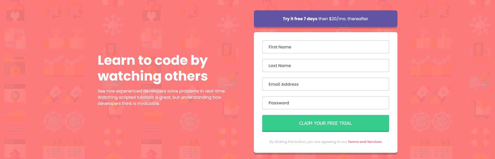

# Frontend Mentor - Intro component with sign up form solution

This is a solution to the [Intro component with sign up form challenge on Frontend Mentor](https://www.frontendmentor.io/challenges/intro-component-with-signup-form-5cf91bd49edda32581d28fd1). Frontend Mentor challenges help you improve your coding skills by building realistic projects. 

## Table of contents

- [Overview](#overview)
  - [The challenge](#the-challenge)
  - [Screenshot](#screenshot)
  - [Links](#links)
- [My process](#my-process)
  - [Built with](#built-with)
  - [What I learned](#what-i-learned)
  - [Useful resources](#useful-resources)
- [Author](#author)

## Overview

### The challenge

Users should be able to:

- View the optimal layout for the site depending on their device's screen size
- See hover states for all interactive elements on the page
- Receive an error message when the `form` is submitted if:
  - Any `input` field is empty. The message for this error should say *"[Field Name] cannot be empty"*
  - The email address is not formatted correctly (i.e. a correct email address should have this structure: `name@host.tld`). The message for this error should say *"Looks like this is not an email"*

### Screenshot

### Links

- GitHub Repo: [Project repository](https://github.com/Shadowbest/intro-with-sign-up-form)
- Live Site URL: [Project URL](https://shadowbest.github.io/intro-with-sign-up-form/)

## My process

### Built with

- Semantic HTML5 markup and ARIA attributes
- CSS custom properties
- Flexbox
- CSS Grid
- Mobile-first workflow
- JavaScript

### What I learned

In this challenge I learned mainly the basics of how to do client-side JavaScript validation. With functions to help with common issues and more specific problems with filling up a form.

### Useful resources

- [JavaScript.info](https://javascript.info) - This page is really good for learning or at least grasping the fundamentals of modern JavaScript as well supplement what is already learned.

- [MDN](https://developer.mozilla.org/en-US/docs/Web/JavaScript) - This is an amazing site to begin learning javascript as well as other technologies. Good reference material for web development topics.

## Author

- Frontend Mentor - [@Shadowbest](https://www.frontendmentor.io/profile/Shadowbest)
